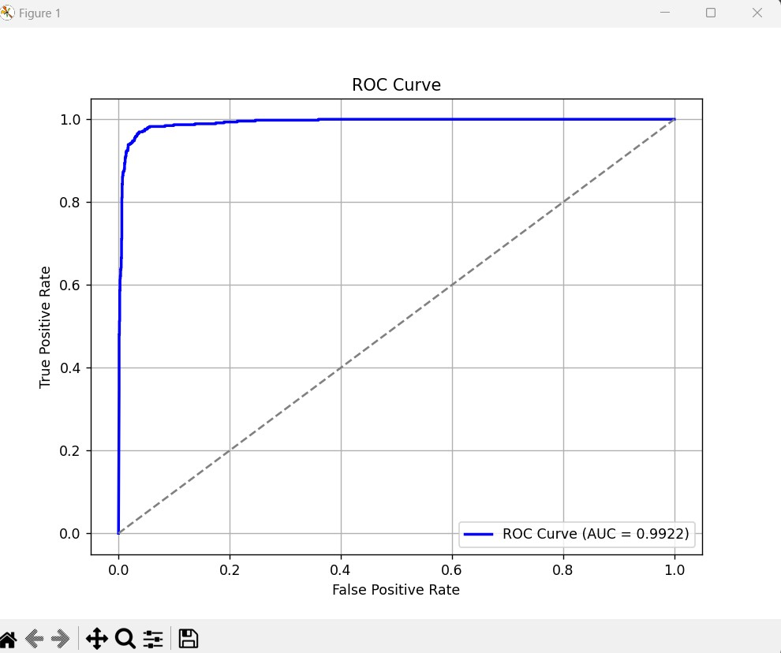

# Epileptic Seizure Recognition Project

## Project Overview
This project focuses on building a binary classifier using a neural network to recognize epileptic seizures from time series data. The classifier is trained on a dataset containing EEG signals, which are used to detect the occurrence of epileptic seizures. The goal is to create a highly accurate model that can distinguish between seizure and non-seizure events using time series data as input features.

## Dataset
The dataset used for this project is from Kaggle : **Epileptic Seizure Recognition**. It contains time series EEG data from patients, where each row represents EEG data captured over time, and the last column contains the label indicating whether the data corresponds to an epileptic seizure with 1 being seizure and 2-5 being non-seizure data labels.

- **Link to Dataset**: [Epileptic Seizure Recognition Dataset](https://www.kaggle.com/datasets/harunshimanto/epileptic-seizure-recognition/data)

## Model Performance
The model was evaluated using multiple metrics to assess its performance on the test dataset. Below are the key metrics:

- **Accuracy**: `0.9665`
- **ROC-AUC Score**: `0.9826`

### Classification Report:
| Class | Precision | Recall | F1-Score | Support |
|-------|-----------|--------|----------|---------|
| 0.0   | 0.97      | 0.99   | 0.98     | 1840    |
| 1.0   | 0.95      | 0.88   | 0.91     | 460     |
| **Accuracy** |       |        | **0.97** | **2300** |
| **Macro Avg** | 0.96 | 0.93   | 0.95     | 2300    |
| **Weighted Avg** | 0.97 | 0.97   | 0.97     | 2300    |

### ROC Curve
Below is the ROC Curve for the trained model:



## Setup

### Create a Virtual Environment

```bash
# On Windows
python -m venv venv
venv\Scripts\activate

# On Linux/macOS
python3 -m venv venv
source venv/bin/activate
```
### Install Dependencies
```bash
pip install -r requirements.txt
```

## Running the Project
This is the entry point for data processing, training and evaluating the model.
```bash
python main.py
```


